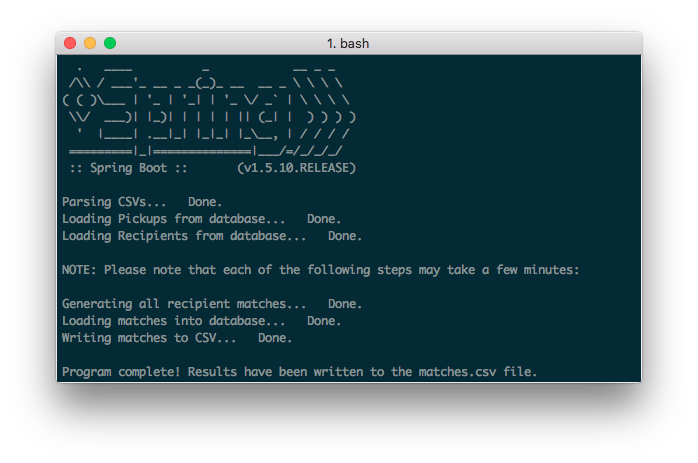
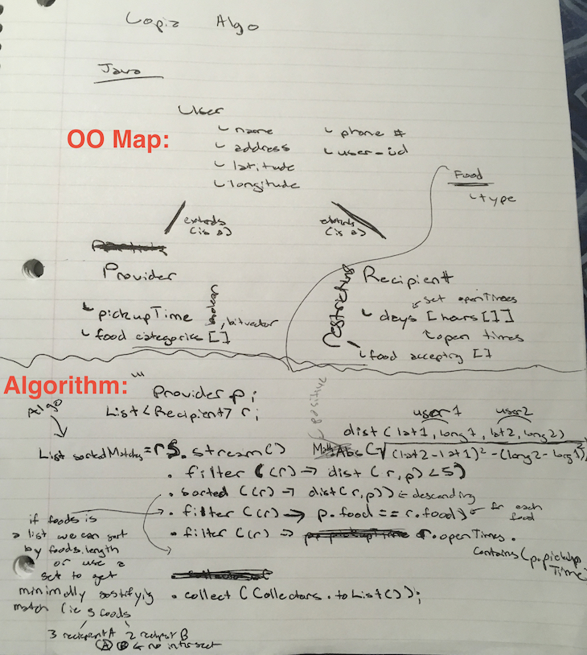
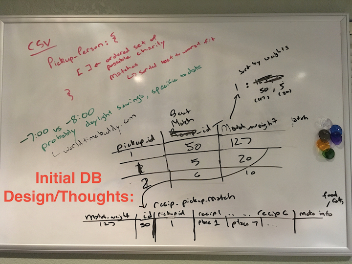
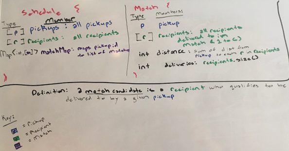

# Copia

Welcome to Copia! This is a scheduling algorithm for matching food donations to local charities.



This project was built with Spring Boot (Java) and H2.

All performance metrics are from running the program on my Early 2011 MacBook Pro (16 GB RAM, 2 GHz Intel Core i7). 

# Table of Contents

- [Configuration](https://gitlab.com/hkailahi/copia/blob/master/README.md#configuration)
    - [Quick Start](https://gitlab.com/hkailahi/copia/blob/master/README.md#quick-start)
    - [Step By Step](https://gitlab.com/hkailahi/copia/blob/master/README.md#step-by-step)
    - [Interact with Database](https://gitlab.com/hkailahi/copia/blob/master/README.md#interact-with-database)
- [Rules](https://gitlab.com/hkailahi/copia/blob/master/README.md#rules)
- [Implementation Details](https://gitlab.com/hkailahi/copia/blob/master/README.md#implementation-details)
    - [Program Steps](https://gitlab.com/hkailahi/copia/blob/master/README.md#program-steps)
    - [Core Datatypes](https://gitlab.com/hkailahi/copia/blob/master/README.md#core-datatypes)
        - User
        - Pickup
        - Recipient
        - Match
    - [Schedule](https://gitlab.com/hkailahi/copia/blob/master/README.md#schedule)
- [How I Made It](https://gitlab.com/hkailahi/copia/blob/master/README.md#how-i-made-it)
    - [Initial Thoughts](https://gitlab.com/hkailahi/copia/blob/master/README.md#initial-thoughts)
        - 1-to-Many, Domain->Codomain
        - Pre-coding Sketches
    - [Approach](https://gitlab.com/hkailahi/copia/blob/master/README.md#approach)
        - [Why did you use a database?](https://gitlab.com/hkailahi/copia/blob/master/README.md#q-why-did-you-use-a-database)
        - [Why did you switch from Postgres to H2?](https://gitlab.com/hkailahi/copia/blob/master/README.md#q-why-did-you-switch-from-postgres-to-h2)
        - [What is a k-sum? What does it solve? Why did you ultimately not use it?](https://gitlab.com/hkailahi/copia/blob/master/README.md#q-what-is-k-sum-what-does-it-solve-why-did-you-ultimately-not-use-it)
        - [Why did you use parallel streams?](https://gitlab.com/hkailahi/copia/blob/master/README.md#q-why-did-you-use-parallel-streams)
        - [Why are you sorting each list of recipients before adding them to the matchMap hashtable?](https://gitlab.com/hkailahi/copia/blob/master/README.md#q-why-are-you-sorting-each-list-of-recipients-before-adding-them-to-the-matchmap-hashtable)
    - [Results Analysis]()
        - [Why do larger matches exist that contain smaller matches?](https://gitlab.com/hkailahi/copia/blob/master/README.md#q-why-do-larger-matches-exist-that-contain-smaller-matches)
        - [How many matches? How many pickups can't completed by going to one recipient?](https://gitlab.com/hkailahi/copia/blob/master/README.md#q-how-many-matches-how-many-pickups-cant-completed-by-going-to-one-recipient)
- [Conclusion](https://gitlab.com/hkailahi/copia/blob/master/README.md#conclusion)

# Configuration
## Quick Start

 - You will need Java 8 and Maven to build and run this project.
     - Maven is a Java build/package manager that will use the pom.xml file.
 - Run the following in a terminal window.
 
    ```bash
        $ mvn clean package -DskipTests
        $ java -jar target/copia-0.0.1-SNAPSHOT.jar
    ```


## Step By Step

- Install JDK and make sure your JAVA_HOME environment variable is set.
    - Check with echo

        ```bash
        $ echo $JAVA_HOME
        /Library/Java/JavaVirtualMachines/jdk1.8.0_91.jdk/Contents/Home
        ```
    - On a Mac, you can set JAVA_HOME in the .bash_profile in your home directory.

      ```bash
        $ emacs .bash_profile

        export JAVA_HOME=$(/usr/libexec/java_home)

        $ source .bash_profile

        $ echo $JAVA_HOME
        /Library/Java/JavaVirtualMachines/jdk1.8.0_91.jdk/Contents/Home
      ```
- Configure maven (Java build tool / package manager)
    - Install from https://maven.apache.org/download.cgi and follow installation instructions from https://maven.apache.org/install.html .
        - On Mac, the step "Add the bin directory of the created directory apache-maven-3.5.2 to the PATH environment variable" can be done by adding the following to your .bash_profile    

        ```bash
        export PATH=$PATH:/opt/apache-maven-3.5.2/bin:$PATH
        ```
- Build project
  ```bash
    $ mvn clean package -DskipTests
  ```
    - This will build and install the necessary dependencies like Spring Boot, H2, and more.
- Run the project
    ```bash
    $ java -jar target/copia-0.0.1-SNAPSHOT.jar
    ```
    
## Interact with Database
- To run SQL queries in H2, please update the boolean [willInteractWithDatabase](https://gitlab.com/hkailahi/copia/blob/master/src/main/java/com/heneli/copia/CopiaApplication.java#L84) to true. Please note, you will have to manually shut down the server once you are finished!

[↥ back to top](https://gitlab.com/hkailahi/copia/blob/master/README.md#copia)

# Rules

(Project instructions hidden.)

[↥ back to top](https://gitlab.com/hkailahi/copia/blob/master/README.md#copia)

# Implementation Details

#### Program Steps

1. Spring Boot launches Tomcat server with H2 instance available on *localhost:8080/h2*
2. *schema.sql* in src/java/resources/ gets ran before *run()* method in core app (*CopiaApplication.java*), which imports Pickups and Recipients CSVs as tables, and initializes empty *Matches* table
3. List of all pickups and list of all recipients are loaded from H2 into the core application
4. *Schedule* is created, calls *generateSchedule* on itself, and populates the *matchMap* hashtable by keying pickup ids to matches
5. Matches sent from *MatchMap* into H2
6. (Optional) *Matches* table is sorted
7. *Matches* table is exported to a CSV in the project directory
8. (Optional) Application code shuts down Tomcat server

#### Core Datatypes

**User**

- A *User* holds the overlapping columns from Pickups and Recipients. *User* also contains a method for calculating its distance from another *User*.

**Pickup**

- A *Pickup* is a *User* that, using its *pickupAt* (LocalDateTime) and *timeZoneId* (ZoneId) fields, calculates a *zonedDateTime* field. *zonedDateTime* uses a temporal Java datatype equipped to handle the UTC offset in ISO 8601.

**Recipient**

- A *Recipient* is a *User* that holds boolean methods to determine whether a given pickup can be received.   

**Match**

- A *Match* represents a complete delivery opportunity by mapping single pickup to a list of recipients. A match may have up to six recipients. In the six recipient case, a pickup will provide the maximum six food categories, and each recipient will take one of the categories that the others have not.

#### Schedule

A *Schedule* creates a mapping from pickups to matches. To do this, a mapping of pickups to qualified recipients is created. Then, the list of matches for each pickup is generated by matching that pickup against one or several of its qualified recipients. 

[↥ back to top](https://gitlab.com/hkailahi/copia/blob/master/README.md#copia)

# How I Made It

## Initial Thoughts

Please see all initial thoughts [here](docs/initial_thoughts.md)!

Starting off, I thought that a match-making algorithm would be a two-sided scheduling problem. Instead, I found it better to represent a match as a one-way, 1-to-many relationship from a pickup to recipients. Thus, the problem becomes much simpler as no pickup is reliant on information between a recipient's mapping to itself or other pickups.

Below are some sketches of what I thought my program would look like before I wrote any code.





[↥ back to top](https://gitlab.com/hkailahi/copia/blob/master/README.md#copia)

## Approach

##### Q: Why did you use a database?
Letting a RDBMS handle parsing the CSV is easier than rolling my own parser. Also, a database allowed me to easily inspect the data.
 
I started with Postgres. Postgres supports a *timestamptz*, or *timestamp with time zone*, datatype which handles ISO 8601 temporal data, including the UTC offset.

##### Q: Why did you switch from Postgres to H2?
Setting up Postgres and managing a connection would require more configuration for me or the user, so I started looking into embedded databases as a substitute. After looking at Apache Derby, Java DB, and H2, I determined that H2 had the best support for the temporal values I would be using. Unfortunately, H2 drops UTC offset information when parsing the Pickups CSV. This is acceptable for me, however, as I can re-calculate the UTC offset by using the timeZoneId and Java 8's Date API.

##### Q: What is k-sum? What does it solve? Why did you ultimately not use it? 

A k-sum is a generalization of the 2Sum and 3Sum algorithms. If a list of values exists such that two values can be added up to a given target value, a 2Sum is an efficient way to find the indices of those two elements. A 2Sum use a HashTable to cache complementary values and replaces a typical O(n^2) algorithm into a linear one. A 3Sum uses sorting and comparisons on shrinking exterior indices to find three values that add up to a given target.

I thought that using a k-sum could help reduce the expensive match-making algorithm I would need to implement.

Modifying a k-sum to find complementary bitvectors turns out to only work if the bitvectors are what I defined to be 'perfect matches'. Here, a perfect match is a grouping of bitvectors where: 
1. The grouping can be OR'd (bitwise) together make a bitvector (target sum) with only ones
2. The i-th bit can be 1 in only one bitvector of any of in the grouping

I decided I would use the k-sum approach if all pickups who provided food contained perfect matches. Then, I [charted problematic pickup candidates](docs/match_chart.md) who did not have one recipient matches. As a few did not, I could not make use of it.

##### Q: Why did you use parallel streams?

In my first algorithm, it was taking around 5 seconds to compute each pickups' four recipient matches. With ~200 pickups, that meant almost 20 minutes! This wasn't including the five or six recipient matches, which would my computer wouldn't have been able to handle.

Using link I found from the References section in 'Effective Java - 3rd Edition' called [*When to use parallel streams*](http://gee.cs.oswego.edu/dl/html/StreamParallelGuidance.html), I determined that parallel streams could be used to cut down on this time.

Reasons it worked:
1. A list of all pickups is splittable into individual pickups
2. Individual pickups are independent of the each other, (i.e., no path from one pickup to another exists - see [my initial observation](https://gitlab.com/hkailahi/copia/blob/master/README.md#initial_thoughts))
3. The algorithm is computationally expensive, as another nested traversal of recipients is required for finding matches for each additional recipient in a match (N >= 10000)
4. MatchMap can be turned to ConcurrentHashMap to synchronize on writes

Using parallel streams allows me to compute four recipient matches on my laptop in less than five minutes.

If my application hadn't been mostly single-threaded I wouldn't have seen such tremendous improvements. Since I was using using a functional programming style in the algorithm, adapting the code for parallelism was fairly straightforward.

##### Q: Why are you sorting each list of recipients before adding them to the *matchMap* hashtable?

I use a HashSet data structure to ensure that I do not add duplicate matches into the *matchMap*. A list of recipients r1 containing the ordered pair (recipient #7, recipient #121) would not be counted as a duplicate to list r2 containing the ordered pair (recipient #121, recipient #7) because the list datatype contains the notion of order. Thus, sorting each list prior allows me to know that logical duplicates will not be added.  

[↥ back to top](https://gitlab.com/hkailahi/copia/blob/master/README.md#copia)

## Results Analysis

##### Q: Why do larger matches exist that contain smaller matches?

These cases can be seen as partial deliveries to recipients who could have taken more in order to allow receival by other recipients who would otherwise be left out.

Eliminating these larger matches should not be done because it is: 
1. Not useful
    - We want to deliver the smaller subsets anyways, so requiring the generation of bigger ones should actually be avoided.
2. Not possible.. at least on my laptop 
    - This is a powerset problem, where all subsets of a larger match must be checked. This would require an exponential function (O(2^n)) nested at each level inside an already expensive O(pbq^6)+ algorithm.

##### Q: How many matches did you find? How many pickups can't completed by going to one recipient? 

I was able to compute 1604551 matches. 

There are 12 pickups that are unable to complete deliveries without using more than one recipient. Of those 12, 4 cannot complete any match. 3 of the 4 do not provide any food. As they have nothing to provide, it makes sense that they are unable to make a match. The remaining pickup is pickup #60 from James Whitehouse, who can at best make a partial match with recipient #131 Maria Allen by providing raw meat and seafood. No qualified recipients will take his hot, prepared food.

You can see more in [here](docs/match_chart.md) and [here](docs/four_recipient_delivery.md).

[↥ back to top](https://gitlab.com/hkailahi/copia/blob/master/README.md#copia)

## Conclusion

This problem was very computationally intensive. While the algorithm is fine for an increasing amount of pickups, it is very sensitive to increases in the number of qualified recipients (O(pbq^6)+). Finding the qualified recipients for all pickups requires much less computation (O(pbr) where b is the longer length of either the open hours field or the restrictions field in recipients). As real estate is expensive, it is unlikely that an *extremely* dense supply of recipients will occur. 

Cities are a problem because they are fairly dense and numerous along all of our parameters. Cities are also the most likely produce customers. Aggressive filtering, such as only restricting deliveries to small distances, keeping the number of food categories small, and only accepting pickups during primary hours, is essential to making match-making manageable. In a real world algorithm, tuning could be done to shrink delivery radii in cities. Pickups would still be able to find qualified recipients as a city is more likely to provide the necessary infrastructure for numerous recipients per unit area. Another improvement would be introducing a feature that cheapened deliveries to recipients who accepted all that a pickup provided at once. This would allow us to not have use the nested parts of a multi-recipient algorithm as often. Finally, match possibilities could be pre-computed for given areas so that a new pickup could use cached solution.

[↥ back to top](https://gitlab.com/hkailahi/copia/blob/master/README.md#copia)